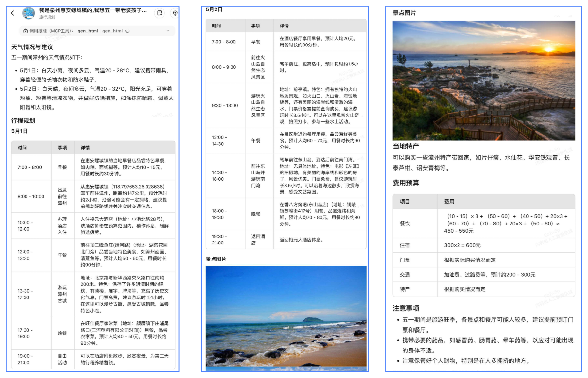
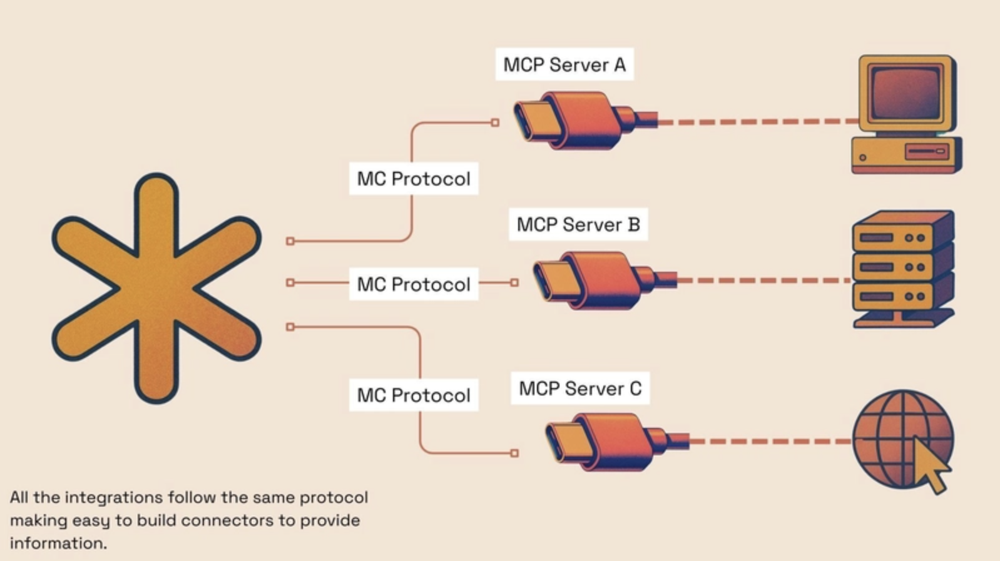
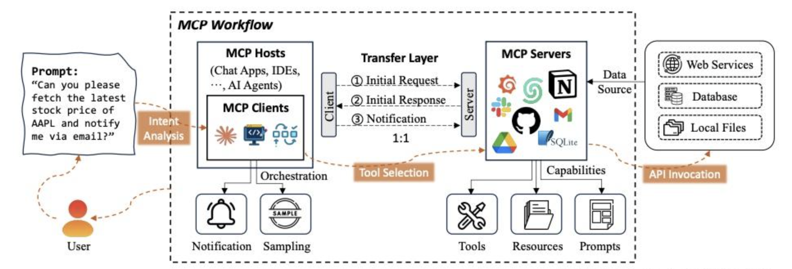
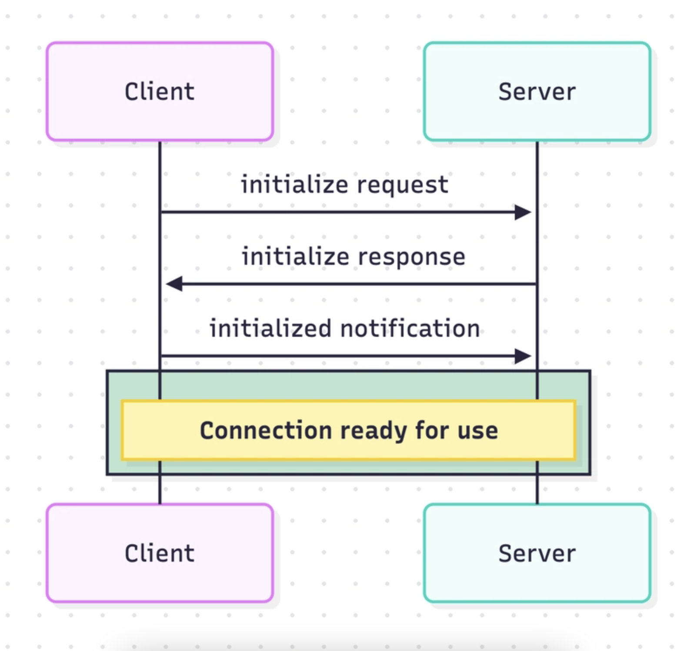

# 模型上下文协议（MCP）完全指南：从入门到实践

## 前言

大家好，我是阿睿，一位爱折腾的前端工程师——白天敲代码构建数字世界，夜晚学吉他谱写生活旋律。

今天，我将以小白的身份，深入探讨一项备受瞩目的技术——模型上下文协议（MCP）。这项技术的出现标志着 AI 交互方式的重大变革，为我们带来了全新的可能性。通过这篇文章的学习，你将了解到 MCP 的诞生背景、基本概念、实现原理和应用场景，让我们一起揭开这项神奇技术的面纱！

## MCP 的诞生：为什么需要模型上下文协议（MCP）？

随着人工智能（AI）技术的飞速发展，我们的生活和工作方式正在悄悄发生翻天覆地的变化。

回想一下，从初代 ChatGPT 诞生至今，我们与 AI 的互动主要依赖文本输入和输出这种最基础的方式。然而，随着我们对 AI 期望值的不断提高，这种单一的交互模式已经难以满足我们日益增长的工作和生活需求，对我们普通用户来说既不够直观也缺乏灵活性。

我们渴望一种更智能、更自然的交互体验，毕竟现实生活中的沟通早已超越了冷冰冰的文字，而是充满了丰富的情感和个性化的表达。我们期待 AI 能像理解老朋友一样，准确捕捉我们的真实意图，提供贴心又个性化的服务体验。

### 从实例看 MCP 的魔力：一句话生成完整旅游攻略

来看一个生活中的实际例子（来源微信技术群）：假设我们想通过 AI 助手规划一次五一假期出行，只需在 AI 助手软件中简单输入："我是泉州惠安螺城镇的，五一想去 xxx 地游玩 3 日，请帮忙制作一个旅游攻略..."。

神奇的是，AI 大模型立刻能根据这简单的一句话，自动查询目标地的住宿、景点、餐饮等全方位信息，然后整合成一份详尽的攻略，效果如下图所示：



这份攻略不仅包含了详细的行程规划、当地特色美食（截图中未完全显示）、必游景点推荐，还贴心地提供了费用预算和注意事项。内容说是面面俱到，让人不禁感叹它真的好"智能"啊！说实话，比很多男朋友做的攻略都要详细得多呢！

### MCP 的核心价值：打破 AI 与外部世界的壁垒

那么，这背后到底藏着什么"黑科技"呢？

如果按照传统的交互方式，我们可能需要输入大量信息，一步步引导 AI 才能得到满意的结果。而模型上下文协议（MCP）正是为解决这一痛点而生的。它通过巧妙引入模型上下文，将我们简单的指令和潜在需求自动转化为模型能理解的形式，从而实现更智能、更贴心的交互体验。

简单来说，当我们输入目的地时，MCP 技术让模型能够主动获取相关信息（如住宿、景点、餐饮等），自动将这些信息转化为模型可理解的结构化数据，最终整合成一份完整的攻略。我们只需动动手指，输入一个简单指令，就能收获一份专业详尽的旅行计划，是不是很神奇？

## MCP 解析：AI 世界的"万能接口"

模型上下文协议（MCP）是由 Anthropic 公司于 2024 年 11 月为其 Claude AI 正式推出的创新技术，如今已在人工智能领域引起广泛关注。这项技术迅速获得了行业认可，从 OpenAI 和 Neon 到 Cloudflare 和 Sentry 等众多科技公司都在积极开发自己的 MCP 服务器实现。

### MCP 的三大核心概念

接下来，我们先通过基本概念了解这项改变 AI 交互方式的重要协议。

- Modal（模型）：指的是大预言模型或人工智能模型（LLM），如 GPT-4、GPT-3.5、Claude 等。
- Context（上下文）：提供给模型的数据或相关信息，包含对话、prompt 等，用于指导模型的行为和输出。
- Protocol（协议）：一组规则和标准，定义了模型和上下文之间的交互方式和规范。

MCP 诞生即成了关注的热点，它成为了一套统一的标准，为大型语言模型提供上下文或相关信息。Anthropic 将其描述为 AI 模型的 USB-C 端口——一种通用的连接和交互方式。

## USB-C 的启示：为什么 MCP 是 AI 的统一接口？



你有没有注意到，如今我们的数码设备连接线正变得越来越统一了？回想一下，过去手机充电接口就有 Mini-USB、Micro-USB、Lightning 等多种类型，让人头疼不已。而 USB-C 的出现彻底改变了这一切，它就像一个数字世界的"万能钥匙"。一个小小的接口，却能满足几乎所有需求——充电、数据传输、视频输出，样样精通。现在出门在外，只需随身携带一条 Type-C 线，就能同时搞定手机、笔记本电脑甚至平板的充电问题，方便得让人爱不释手。

MCP 旨在为 AI 实现统一接口的目标。它就像数字世界的 USB-C 接口，为 AI 模型提供了一种通用的连接方式。想象一下现实场景：如果 10 家不同的智能家居公司各自开发专属协议，那么一个拥有 20 种智能设备的家庭将需要对应的安装 10 个不同的控制应用，管理 200 个独立连接点——这无疑不是用户体验的噩梦。MCP 正是解决了 AI 领域类似的问题，它创建了一种标准化的通信协议，使任何 AI 模型都能通过同一套接口与各类数据源和工具无缝交互，大大降低了开发成本和使用门槛。

## MCP 架构详解：客户端-服务器模式的优雅实现



如上图所示：MCP 基于客户端-服务器（CS）架构，由三个核心组件构成：MCP 主机、MCP 客户端和 MCP 服务器。这些组件协同工作，实现 AI 应用与外部工具和数据源之间的无缝通信。

- **MCP 主机**：提供执行 AI 任务的环境，并运行 MCP 客户端。
- **MCP 客户端**：作为主机环境中的中介，管理 MCP 主机与一个或多个 MCP 服务器之间的通信，比如 Cursor、Claude Desktop、Cline。
- **MCP 服务器**：提供外部系统和操作的访问权限，具备工具、资源和提示三种核心能力。

## MCP 的三大核心能力：工具、资源与提示

MCP 上下文（Context）通过三个关键组件实现了信息的标准化传递，让 AI 模型与外部世界无缝沟通：

1. **工具（Tools）**：这些是预先定义好的功能函数，就像 AI 的"超能力"，使模型能够与外部系统进行互动。例如，一个搜索工具可以让 AI 查询最新的天气信息或股票价格。

2. **资源（Resources）**：可以将其理解为 AI 的"知识库"，是通过 MCP 服务器可访问的各类数据源。这些资源为 AI 提供了丰富的背景信息，使其回答更加准确全面。

3. **提示词（Prompts）**：这是指导 AI 如何处理信息的"说明书"，以结构化的形式告诉模型应该如何与数据互动，从而产生符合预期的输出。

通过这种标准化设计，任何兼容 MCP 的 AI 模型都能够轻松理解如何通过 MCP 服务器获取所需数据（资源）、执行特定操作（工具）或按照特定方式处理信息（提示词）。

当 AI 模型需要获取外部信息时，整个流程如同一次高效的"信息接力"：模型首先通过 MCP 客户端向对应的 MCP 服务器发送请求，服务器随后从相关数据源获取所需信息并返回给客户端，最后客户端将这些信息传递给 AI 模型。这一精心设计的过程确保了 AI 模型始终能够获取最相关、最新鲜的上下文信息，从而提供更智能、更准确的回应。

## MCP 的通信机制

在前面的内容中，我们已经了解了 MCP 的基本架构和组件。现在，让我们深入探讨 MCP Client 是如何与 MCP Server 进行通信的。


上图展示了 MCP 初始化过程：

1. 客户端发送带有协议版本和功能 initialize 请求
2. 服务器响应带有协议版本和功能列表的 initialize 响应
3. 客户端发送 initialized 通知作为确认
4. 开始正常消息交换

MCP 采用了基于 HTTP 的 JSON-RPC 协议进行通信，这是一种轻量级的远程过程调用协议。当 AI 模型需要访问外部数据或执行特定操作时，MCP Client 会向 MCP Server 发送一个结构化的 JSON 请求，Server 处理后返回相应的 JSON 响应。

一个典型的 MCP 请求-响应流程如下：

1. AI 模型识别需要外部数据或工具支持的任务
2. MCP Client 构建一个包含方法名和参数的 JSON-RPC 请求
3. 请求通过 HTTP POST 方法发送到 MCP Server
4. Server 解析请求，执行相应操作（如查询数据库、调用 API 等）
5. Server 将结果打包成 JSON 响应返回给 Client
6. Client 解析响应并将结果提供给 AI 模型

这种通信机制的优势在于：

- 标准化 ：使用广泛接受的 HTTP 和 JSON 标准
- 轻量级 ：低延迟，适合实时 AI 交互
- 跨平台 ：不受操作系统或编程语言限制
- 可扩展 ：易于添加新的功能和工具

## MCP Server 的实现原理

MCP Server 是 MCP 架构中提供实际功能和数据的组件。它接收来自 Client 的请求，执行相应的操作，并返回结果。

### MCP Server 的核心组件

一个功能完整的 MCP Server 通常包含以下组件：

1. HTTP 服务器 ：接收和响应 HTTP 请求
2. JSON-RPC 处理器 ：解析 JSON-RPC 请求并调用相应的方法
3. 方法注册表 ：维护可用方法的列表及其实现
4. 认证和授权 ：验证请求的合法性并控制访问权限
5. 资源管理器 ：管理与外部系统（如数据库、API）的连接
6. 缓存系统 ：缓存频繁请求的结果以提高性能
7. 日志和监控 ：记录请求和错误，监控服务器状态
   当 Server 收到请求时，它会验证请求格式，检查认证信息，然后调用相应的方法处理请求。处理完成后，将结果打包成 JSON 响应返回给 Client。
8. 功能注册器 ：负责注册 MCP Server 提供的功能，包括工具、资源和提示

当 Server 收到请求时，它会验证请求格式，检查认证信息，然后调用相应的方法处理请求。处理完成后，将结果打包成 JSON 响应返回给 Client。

## MCP Client 的实现原理

MCP Client 作为 AI 应用与 MCP Server 之间的桥梁，其核心功能是管理与一个或多个 Server 的连接，并处理请求和响应。

### MCP Client 的核心组件

一个典型的 MCP Client 包含以下核心组件：

1. 连接管理器 ：负责建立和维护与 MCP Server 的连接，处理连接池、重试逻辑和故障转移
2. 请求构建器 ：根据 AI 模型的需求构建符合 MCP 规范的 JSON-RPC 请求
3. 响应处理器 ：解析从 Server 返回的 JSON 响应，并将结果转换为 AI 模型可用的格式
4. 会话管理 ：维护用户会话状态，确保请求的上下文连贯性
5. 错误处理 ：处理网络错误、超时和服务器错误，提供适当的回退策略

当 AI 模型需要访问外部数据时，Client 会根据需求选择合适的 Server，构建请求并发送。例如，当用户询问天气信息时，Client 可能会向天气服务的 MCP Server 发送请求，获取最新的天气数据。

```javascript
// MCP Client 请求示例
const request = {
  jsonrpc: "2.0",
  method: "getWeather",
  params: {
    location: "北京",
    units: "metric",
  },
  id: "request-123",
};

// 发送请求到 MCP Server
const response = await mcpClient.sendRequest("weather-server", request);
```

## 实战教程：打造你的第一个 MCP 服务器

MCP 服务器可以提供三种主要类型的功能：

1. 工具 ：可由 LLM 调用的函数，提供特定的功能，如查询天气、获取新闻等
2. 资源 ：提供外部数据，客户端可以读取的类似文件的数据、数据库、API 等
3. 提示 ：预先编写的模板，帮助用户完成特定任务，如生成新闻标题、生成 SQL 语句等

接下来我们将使用`typescript`，学习如何创建一个 工具类型的 MCP Server。

### 1. 环境准备与依赖安装

```bash
# 创建一个新的工程目录
mkdir weather
cd weather

# 初始化npm项目
npm init -y

# 安装依赖
npm install @modelcontextprotocol/sdk zod
npm install -D @types/node typescript

# 创建文件夹、入口文件
mkdir src
touch src/index.ts
```

> zod 是一个用于类型检查的库，常用于表单、api 接口字段校验，我们将在后面的代码中使用它。

更新 package.json 以添加类型：“module”和构建脚本：

```json
{
  "type": "module",
  "bin": {
    "weather": "./build/index.js"
  },
  "scripts": {
    "build": "tsc && chmod 755 build/index.js"
  },
  "files": ["build"]
}
```

接着需要简单配置下 tsconfig.json 文件：

```json
{
  "compilerOptions": {
    "target": "ES2022",
    "module": "Node16",
    "moduleResolution": "Node16",
    "outDir": "./build",
    "rootDir": "./src",
    "strict": true,
    "esModuleInterop": true,
    "skipLibCheck": true,
    "forceConsistentCasingInFileNames": true
  },
  "include": ["src/**/*"],
  "exclude": ["node_modules"]
}
```

### 2. 代码实现步骤

#### 2.1 MCP Server 初始化

在`src/index.ts`文件中，我们将编写一个简单的 MCP Server，用于提供天气查询的功能。

```ts
import { McpServer } from "@modelcontextprotocol/sdk/server/mcp.js";
import { StdioServerTransport } from "@modelcontextprotocol/sdk/server/stdio.js";
import { z } from "zod";

// 定义天气查询的输入参数类型
const NWS_API_BASE = "https://api.weather.gov";
const USER_AGENT = "weather-app/1.0";

// 创建 MCP 服务器实例
const server = new McpServer({
  name: "weather",
  version: "1.0.0",
  capabilities: {
    resources: {},
    tools: {},
  },
});
```

这段代码很简单，我们创建了一个 MCP 服务器实例，并设置了服务器的名称和版本号。接下来我们将创建一些辅助函数，完善整个工具的功能。

#### 2.2 辅助函数实现

现在添加一些辅助函数，用于负责请求 API 数据和数据格式化处理：

```ts
// 请求 NWS API 数据辅助函数
async function makeNWSRequest<T>(url: string): Promise<T | null> {
  const headers = {
    "User-Agent": USER_AGENT,
    Accept: "application/geo+json",
  };

  try {
    const response = await fetch(url, { headers });
    if (!response.ok) {
      throw new Error(`HTTP error! status: ${response.status}`);
    }
    return (await response.json()) as T;
  } catch (error) {
    console.error("Error making NWS request:", error);
    return null;
  }
}

interface AlertFeature {
  properties: {
    event?: string;
    areaDesc?: string;
    severity?: string;
    status?: string;
    headline?: string;
  };
}

// 格式化警报数据函数
function formatAlert(feature: AlertFeature): string {
  const props = feature.properties;
  return [
    `Event: ${props.event || "Unknown"}`,
    `Area: ${props.areaDesc || "Unknown"}`,
    `Severity: ${props.severity || "Unknown"}`,
    `Status: ${props.status || "Unknown"}`,
    `Headline: ${props.headline || "No headline"}`,
    "---",
  ].join("\n");
}

interface ForecastPeriod {
  name?: string;
  temperature?: number;
  temperatureUnit?: string;
  windSpeed?: string;
  windDirection?: string;
  shortForecast?: string;
}

interface AlertsResponse {
  features: AlertFeature[];
}

interface PointsResponse {
  properties: {
    forecast?: string;
  };
}

interface ForecastResponse {
  properties: {
    periods: ForecastPeriod[];
  };
}
```

#### 2.3 注册工具

在上面的步骤中，我们已经创建了 server 实例，接下来我们将注册 2 个工具和对应的执行逻辑，分别是：

1. `get-alerts`：获取最近的天气警报
2. `get-forecast`：获取未来几天的天气预报

```ts
// 注册天气警报工具
server.tool(
  "get-alerts",
  "Get weather alerts for a state",
  {
    state: z.string().length(2).describe("Two-letter state code (e.g. CA, NY)"),
  },
  async ({ state }) => {
    const stateCode = state.toUpperCase();
    const alertsUrl = `${NWS_API_BASE}/alerts?area=${stateCode}`;
    const alertsData = await makeNWSRequest<AlertsResponse>(alertsUrl);

    if (!alertsData) {
      return {
        content: [
          {
            type: "text",
            text: "Failed to retrieve alerts data",
          },
        ],
      };
    }

    const features = alertsData.features || [];
    if (features.length === 0) {
      return {
        content: [
          {
            type: "text",
            text: `No active alerts for ${stateCode}`,
          },
        ],
      };
    }

    const formattedAlerts = features.map(formatAlert);
    const alertsText = `Active alerts for ${stateCode}:\n\n${formattedAlerts.join(
      "\n"
    )}`;

    return {
      content: [
        {
          type: "text",
          text: alertsText,
        },
      ],
    };
  }
);
// 注册天气预报工具
/*
  这个工具的功能是获取未来几天的天气预报。它首先根据给定的经纬度获取对应的网格点数据，然后根据网格点数据获取天气预报数据。
  最后，它将天气预报数据格式化为文本，并返回给调用方。
*/
server.tool(
  "get-forecast",
  "Get weather forecast for a location",
  {
    latitude: z.number().min(-90).max(90).describe("Latitude of the location"),
    longitude: z
      .number()
      .min(-180)
      .max(180)
      .describe("Longitude of the location"),
  },
  async ({ latitude, longitude }) => {
    // Get grid point data
    const pointsUrl = `${NWS_API_BASE}/points/${latitude.toFixed(
      4
    )},${longitude.toFixed(4)}`;
    const pointsData = await makeNWSRequest<PointsResponse>(pointsUrl);

    if (!pointsData) {
      return {
        content: [
          {
            type: "text",
            text: `Failed to retrieve grid point data for coordinates: ${latitude}, ${longitude}. This location may not be supported by the NWS API (only US locations are supported).`,
          },
        ],
      };
    }

    const forecastUrl = pointsData.properties?.forecast;
    if (!forecastUrl) {
      return {
        content: [
          {
            type: "text",
            text: "Failed to get forecast URL from grid point data",
          },
        ],
      };
    }

    // Get forecast data
    const forecastData = await makeNWSRequest<ForecastResponse>(forecastUrl);
    if (!forecastData) {
      return {
        content: [
          {
            type: "text",
            text: "Failed to retrieve forecast data",
          },
        ],
      };
    }

    const periods = forecastData.properties?.periods || [];
    if (periods.length === 0) {
      return {
        content: [
          {
            type: "text",
            text: "No forecast periods available",
          },
        ],
      };
    }

    // Format forecast periods
    const formattedForecast = periods.map((period: ForecastPeriod) =>
      [
        `${period.name || "Unknown"}:`,
        `Temperature: ${period.temperature || "Unknown"}°${
          period.temperatureUnit || "F"
        }`,
        `Wind: ${period.windSpeed || "Unknown"} ${period.windDirection || ""}`,
        `${period.shortForecast || "No forecast available"}`,
        "---",
      ].join("\n")
    );

    const forecastText = `Forecast for ${latitude}, ${longitude}:\n\n${formattedForecast.join(
      "\n"
    )}`;

    return {
      content: [
        {
          type: "text",
          text: forecastText,
        },
      ],
    };
  }
);
```

这段代码看起来比较长，但是逻辑比较简单，我们首先定义了两个工具的参数和返回值类型，中间做了一些容错处理，最后注册了这两个工具。

#### 2.4 MCP Server 启动配置

最后，我们将启动 MCP Server，监听标准输入输出：

```ts
async function main() {
  const transport = new StdioServerTransport();
  await server.connect(transport);
  console.error("Weather MCP Server running on stdio");
}

main().catch((error) => {
  console.error("Fatal error in main():", error);
  process.exit(1);
});
```

### 3. 编译与运行

现在我们已经完成了 MCP Server 的代码编写，接下来我们需要编译并运行它。

```bash
npm run build

```

编译完成后，将在项目根目录下生成一个 build 文件夹，`./build/index.js` 就是我们的 MCP Server 可执行文件。

接下来我们将创建一个 MCP Client，来测试我们的 MCP Server。

## 实战教程：自定义 MCP Client

MCP 技术的出现为 AI 交互方式带来了革命性变革，Claude 和 Cursor 等产品在 MCP 领域的应用已经成为行业标杆。然而，随着这项技术的普及，数据安全问题逐渐浮出水面。许多企业和开发者在拥抱 AI 新能力的同时，对使用第三方开源 Client 客户端存在顾虑，担心敏感数据泄露风险。那么，有没有一种方法既能享受 MCP 带来的智能交互体验，又能确保数据安全呢？

为了解决这一痛点，MCP 生态提供了自定义 MCP Client 的解决方案，允许企业在自己可控的服务器上部署专属 MCP Client，从而在保障数据传输安全的同时，充分利用 MCP 的强大功能。这种方式既满足了企业对数据隐私的严格要求，又不会错过 AI 技术带来的效率提升。

接下来我们将使用 `typescrpt`,学习如何创建一个 MCP Client。

### 1. 创建目录结构

首先，我们需要创建一个新的项目目录：

```bash
# 创建工程
mkdir mcp-client-typescript
cd mcp-client-typescript

# 初始化npm项目
npm init -y

# 安装依赖
npm install @anthropic-ai/sdk @modelcontextprotocol/sdk dotenv

# 安装开发依赖
npm install -D @types/node typescript

# 创建入口文件
touch index.ts
```

我们这里使用了`@anthropic-ai/sdk`和`@modelcontextprotocol/sdk`两个包，`@anthropic-ai/sdk`是 Anthropic 公司提供的 SDK，用于与 Anthropic 的 AI 模型进行交互，而`@modelcontextprotocol/sdk`则是 Model Context Protocol（MCP）的 SDK，用于与 MCP 服务器进行交互。`dotenv`是一个用于加载环境变量的包，我们将在后面的代码中使用它。

接着配置一下`package.json`文件，添加以下内容：

```json
{
  "type": "module",
  "scripts": {
    "build": "tsc && chmod 755 build/index.js"
  }
}
```

然后在项目的根目录下增加`tsconfig.json`文件：

```json
{
  "compilerOptions": {
    "target": "ES2022",
    "module": "Node16",
    "moduleResolution": "Node16",
    "outDir": "./build",
    "rootDir": "./",
    "strict": true,
    "esModuleInterop": true,
    "skipLibCheck": true,
    "forceConsistentCasingInFileNames": true
  },
  "include": ["index.ts"],
  "exclude": ["node_modules"]
}
```

### 2. 设置 API 密钥

在项目根目录下创建`.env`文件，添加以下内容：

> 注意：我们这里将使用 claude 模型，如果你使用的是其他模型，需要替换`ANTHROPIC_API_KEY`的值。

```bash
# 替换为你的API密钥
ANTHROPIC_API_KEY=your_api_key
```

将`.env`文件添加到`.gitignore`文件中，以防止将 API 密钥提交到代码仓库中。

```bash
echo ".env" >> .gitignore
```

### 3. 编写代码

#### 3.1 初始化 MCP Client

在`index.ts`文件中，我们将编写一个简单的 MCP Client，用于与 MCP Server 进行交互。

```ts
import { Anthropic } from "@anthropic-ai/sdk";
import {
  MessageParam,
  Tool,
} from "@anthropic-ai/sdk/resources/messages/messages.mjs";
import { Client } from "@modelcontextprotocol/sdk/client/index.js";
import { StdioClientTransport } from "@modelcontextprotocol/sdk/client/stdio.js";
import readline from "readline/promises";
import dotenv from "dotenv";

// 加载环境变量
dotenv.config();

// 获取环境变量
const ANTHROPIC_API_KEY = process.env.ANTHROPIC_API_KEY;
if (!ANTHROPIC_API_KEY) {
  throw new Error("ANTHROPIC_API_KEY is not set");
}

// 创建 MCP 客户端类
class MCPClient {
  private mcp: Client;
  private anthropic: Anthropic;
  private transport: StdioClientTransport | null = null;
  private tools: Tool[] = [];

  constructor() {
    this.anthropic = new Anthropic({
      apiKey: ANTHROPIC_API_KEY,
    });
    // 创建 MCP 客户端
    this.mcp = new Client({ name: "mcp-client-cli", version: "1.0.0" });
  }
  // methods will go here
}
```

#### 3.2 服务器连接管理

接下来，我们将实现连接 MCP 服务器的方法：

```ts
async connectToServer(serverScriptPath: string) {
  try {
    const isJs = serverScriptPath.endsWith(".js");
    const isPy = serverScriptPath.endsWith(".py");
    if (!isJs && !isPy) {
      throw new Error("Server script must be a .js or .py file");
    }
    const command = isPy
      ? process.platform === "win32"
        ? "python"
        : "python3"
      : process.execPath;

    // 连接到 MCP 服务器
    this.transport = new StdioClientTransport({
      command,
      args: [serverScriptPath],
    });
    this.mcp.connect(this.transport);

    // 注册工具
    const toolsResult = await this.mcp.listTools();
    this.tools = toolsResult.tools.map((tool) => {
      return {
        name: tool.name,
        description: tool.description,
        input_schema: tool.inputSchema,
      };
    });
    console.log(
      "Connected to server with tools:",
      this.tools.map(({ name }) => name)
    );
  } catch (e) {
    console.log("Failed to connect to MCP server: ", e);
    throw e;
  }
}
```

这里我们重点关注`connectToServer`方法，它的作用是连接到 MCP 服务器，并获取可用的工具。`StdioClientTransport` 是 MCP 客户端中用于建立与 MCP 服务器通信的传输层组件。这里，它接收两个关键参数：

- command ：要执行的命令（Node.js 或 Python 解释器路径）
- args ：传递给命令的参数数组，这里只包含服务器脚本的路径

然后，通过 `this.mcp.connect(this.transport); `将这个传输层实例连接到 MCP 客户端，建立与服务器的通信通道。

总结来说， `StdioClientTransport` 是 MCP 客户端中负责底层通信的关键组件，它通过子进程和标准输入/输出流实现了客户端与服务器之间的数据交换。

#### 3.3 处理逻辑

现在我们增加处理查询和处理工具的核心逻辑：

```ts
async processQuery(query: string) {
  const messages: MessageParam[] = [
    {
      role: "user",
      content: query,
    },
  ];

  // 创建 Anthropic 消息
  const response = await this.anthropic.messages.create({
    model: "claude-3-5-sonnet-20241022",
    max_tokens: 1000,
    messages,
    tools: this.tools,
  });

  const finalText = [];
  const toolResults = [];

  // 处理响应
  for (const content of response.content) {
    // 处理文本
    if (content.type === "text") {
      finalText.push(content.text);
    } else if (content.type === "tool_use") { // 处理工具
      const toolName = content.name;
      const toolArgs = content.input as { [x: string]: unknown } | undefined;
      // 调用工具
      const result = await this.mcp.callTool({
        name: toolName,
        arguments: toolArgs,
      });
      toolResults.push(result);
      finalText.push(
        `[Calling tool ${toolName} with args ${JSON.stringify(toolArgs)}]`
      );

      messages.push({
        role: "user",
        content: result.content as string,
      });

      // 再次调用 Claude，大模型会根据上下文进行汇总处理
      const response = await this.anthropic.messages.create({
        model: "claude-3-5-sonnet-20241022",
        max_tokens: 1000,
        messages,
      });

      finalText.push(
        response.content[0].type === "text" ? response.content[0].text : ""
      );
    }
  }

  return finalText.join("\n");
}
```

这里的代码逻辑比较简单，整体思路为：

1. 将用户的查询作为消息发送给 Claude 模型
2. Claude 模型会根据上下文进行进行判断，并返回需要调用 MCP 工具（如果有的话）。
3. 如存在需要调用的工具，我们将调用 MCP 工具，并将工具的结果作为消息发送给 Claude 模型
4. Claude 模型会根据上下文进行汇总处理，并返回最终的结果

#### 3.4 增加交互逻辑

现在我们将添加聊天循环和清理功能

```ts
// 主循环
async chatLoop() {
  const rl = readline.createInterface({
    input: process.stdin,
    output: process.stdout,
  });

  try {
    console.log("\nMCP Client Started!");
    console.log("Type your queries or 'quit' to exit.");

    while (true) {
      const message = await rl.question("\nQuery: ");
      if (message.toLowerCase() === "quit") {
        break;
      }
      const response = await this.processQuery(message);
      console.log("\n" + response);
    }
  } finally {
    rl.close();
  }
}

async cleanup() {
  await this.mcp.close();
}
```

#### 3.5 主入口

最后，我们将在主入口中创建`MCPClient`实例，并启动聊天循环：

```ts
async function main() {
  if (process.argv.length < 3) {
    console.log("Usage: node index.ts <path_to_server_script>");
    return;
  }
  // 创建 MCP 客户端
  const mcpClient = new MCPClient();
  try {
    // 连接到 MCP 服务器
    await mcpClient.connectToServer(process.argv[2]);
    // 启动聊天循环
    await mcpClient.chatLoop();
  } finally {
    await mcpClient.cleanup();
    process.exit(0);
  }
}

main();
```

整体逻辑为：

1. 创建 MCPClient 实例，初始化 MCP 客户端
2. 调用 connectToServer 方法连接到 MCP 服务器，获取可用的工具
3. 启动交互式聊天会话，用户输入查询，AI 模型返回结果
4. 退出时清理资源

### 4. 编译并运行

现在我们已经完成了 MCP Client 的代码编写，接下来我们需要编译并运行它。

```bash
npm run build
```

编译完成后，将在项目根目录下生成一个 build 文件夹，`./build/index.js` 就是我们的 MCP Client 可执行文件。

如果在此自定义 MCP Client 中使用刚开发的天气 MCP Server 工具，我们可以运行以下命令启动 MCP Client：

```bash
node build/index.js .../weather/build/index.js
```

### 思考：

细心的你可能已经发现，我们在上面的代码中使用了 Claude 模型，它能够自动识别并调用 MCP 工具。那么，如果我们换成公司私有化部署的大模型，比如国产的 DeepSeek，它是否也具备同样的能力呢？

实际上，并非所有模型都能自动识别 MCP 工具。Claude 之所以能做到这一点，是因为它内部已经集成了完善的 Function Call 工具集，并内置了对 MCP 工具集的支持。最近，国内刚刚发布的千问 [**Qwen3**](https://qwenlm.github.io/zh/blog/qwen3/) 模型也加入了 Function Call 功能，同样可以识别 MCP 工具。如果你想让自己的模型也具备 MCP 工具识别能力，可以通过补全提示词的方式实现，参考[GitHub 上的这个实现示例](https://github.com/modelcontextprotocol/python-sdk/blob/58c5e7223c40b2ec682fd7674545e8ceadd7cb20/examples/clients/simple-chatbot/mcp_simple_chatbot/main.py#L358)，里面提供了详细的代码实现方法。

以下是一个 python 示例的 prompt，你可以根据自己的需求进行修改：

```python
#... 省略了无关紧要的代码
    async def start(self) -> None:
        """Main chat session handler."""
        try:
            #... 省略了无关紧要的代码
            all_tools = [] # 获取现在所有的工具列表
            for server in self.servers:
                tools = await server.list_tools()
                all_tools.extend(tools)

            tools_description = "\n".join([tool.format_for_llm() for tool in all_tools])
            # 定义一个善于调用各种工具的助手prompt
            system_message = (
                "You are a helpful assistant with access to these tools:\n\n"
                f"{tools_description}\n"
                "Choose the appropriate tool based on the user's question. "
                "If no tool is needed, reply directly.\n\n"
                "IMPORTANT: When you need to use a tool, you must ONLY respond with "
                "the exact JSON object format below, nothing else:\n"
                "{\n"
                '    "tool": "tool-name",\n'
                '    "arguments": {\n'
                '        "argument-name": "value"\n'
                "    }\n"
                "}\n\n"
                "After receiving a tool's response:\n"
                "1. Transform the raw data into a natural, conversational response\n"
                "2. Keep responses concise but informative\n"
                "3. Focus on the most relevant information\n"
                "4. Use appropriate context from the user's question\n"
                "5. Avoid simply repeating the raw data\n\n"
                "Please use only the tools that are explicitly defined above."
            )

            messages = [{"role": "system", "content": system_message}]

            while True:
                try:
                    user_input = input("You: ").strip().lower()
                     #... 省略了无关紧要的代码
                    messages.append({"role": "user", "content": user_input})
                     #问模型我现在应该执行哪些工具
                    llm_response = self.llm_client.get_response(messages)
                    # 执行工具
                    result = await self.process_llm_response(llm_response)
                    #... 省略了无关紧要的代码

                except KeyboardInterrupt:
                    #... 省略了无关紧要的代码
        finally:
            await self.cleanup_servers()
```

## 总结

这篇文章从 MCP 的基本概念开始，逐步介绍了 MCP 的工作原理、MCP Server 和 MCP Client 的实现方法，以及如何使用 MCP 实现自定义工具。通过本文的学习，相信你也对 MCP 有了更深入的理解，希望本文能为你的 AI 开发之旅提供有价值的指引。

最后推荐些好的学习和文章资源：

- [【Github】awesome-mcp-clients：精选的优秀模型上下文协议 (MCP) 客户端列表](https://github.com/punkpeye/awesome-mcp-clients)
- [MCP 技术生态全面综述](https://zhuanlan.zhihu.com/p/1899835645582632589)
